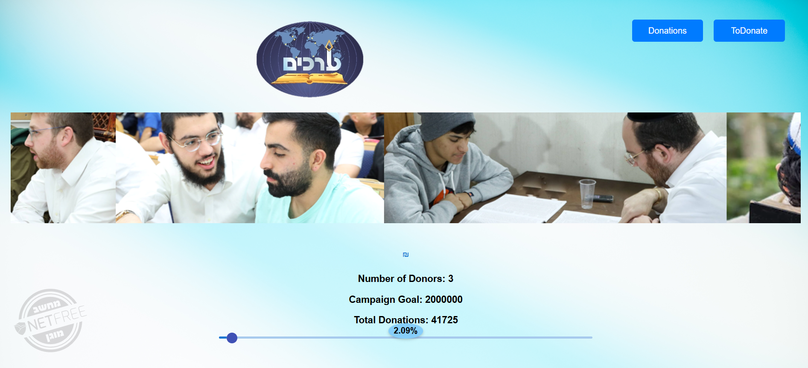
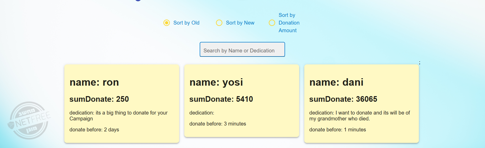

# Donations Campaign for Arachim Organization

This project is a donations campaign website built as part of a coding assignment.  
The campaign is dedicated to raising funds for **Arachim**, a non-profit educational organization.

## Features

- **Live Campaign Statistics**:  
  At the bottom of the page, the following stats are always visible:
  - Total donations so far
  - Percentage of the donation goal reached
  - Total number of donors
  - Campaign donation goal
  


- **Donation Form**:  
  Visitors can donate by filling a simple, user-friendly form.


-  **Donor List**:  
  A dedicated section shows all donors with sorting and filtering options:
  - By newest or oldest donations
  - By donation amount (highest to lowest)


-  **Currency Converter**:  
  Users can toggle between viewing donation amounts in **NIS (₪)** or **USD ($)**.

- **Tech Stack**
React, CSS

- **Getting Started**
To run this project locally, follow the steps below:

1. Clone the Repository
   ```sh
     git clone https://github.com/Riki2149/arachim-campaign
   ```
   ```sh
      cd arachim-campaign
    ```
2. Install Dependencies
   ```sh
     npm install
    ```
4. Run the development client:
   ```sh
     npm run dev
   ```


